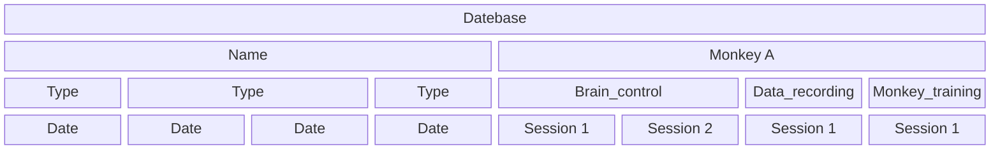
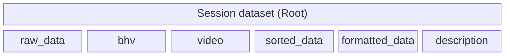
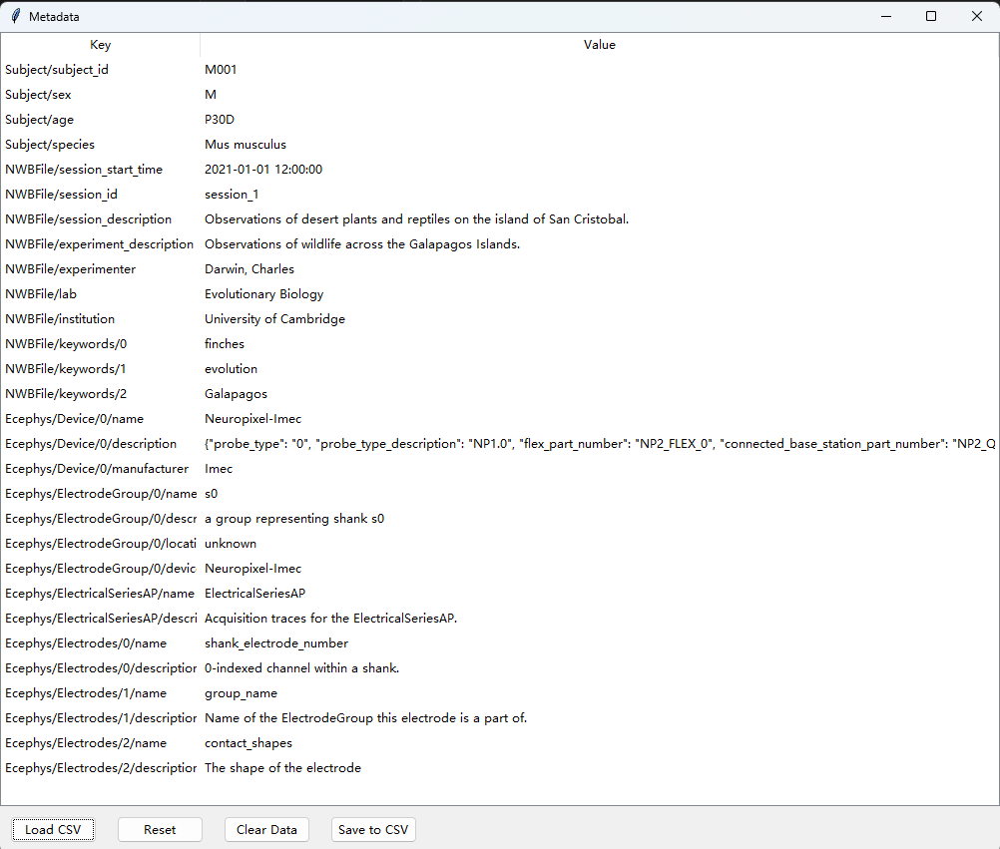
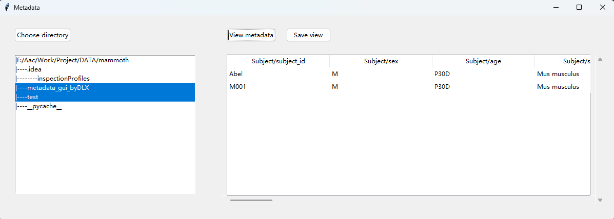

# MAMMOTH Instructions

## Terms
- TCR = threshold crossing rate
- RecordingSystemEvent

## Dataset structure



``` 
[raw_data]: original recording files and converted files
[bhv]: continuous-behavior recording files
[video]: video recording files
[sorted_data]: sorted neural data collected in subfolders named by sorting algorithms
[formatted_data]: formatted NWB files
[description]: checking results and metadata files
```
---

## Data organizer

This `data_organizer.py` aims to distribute files with certain suffix names into target folders with specified names. For example, the files in the forms of .ns6, .ns3, .ns2, .ccf, .nev, and .rec, would be moved to 'raw_data' folder.


> *function* **handle_file(target_folder_name, suffix_name_list, file, file_walk, root_dir)**
> - target_folder_name (str) - the name of the target folder
> - suffix_name_list (list) - the list of the suffix names which should be included in the target folder
> - file_walk (tuple) - as (current directory, sub directory, files) from os.walk
> - root_dir (str) - the parent directory of the target folder
>
> Returns: None

This function would move the files with certain suffix into the target folder.


> *function* **organize_file(root_dir)**
> - root_dir (str) - the root directory for a session
>
> Returns: None

This function would organize the files according this rule: files in forms of .ns6, .ns3, .ns2, .ccf, .nev, and .rec in 'raw_data' folder; files in forms of .mkv, .mp4, and .webm in 'video' folder; files in forms of .png, .mat, .log, .bhv2, and .psydat in 'bhv' folder.


This .py file can also be run in a batch script as

```python ./data_organizer/data_organizer.py -r /the/root/dir```

---

## Data formatter 
### Format continuous-behavior data

This `data_formatter_bhv_continuous.py` aims to format continuous-behavior data into an NWB file. When used, it requires `dependencies`. 

Note: The `SmartNeo` module should be installed in advance.

> *function* **find_files_with_name(root_dir, pattern)**
> - root_dir (str) - the root directory for a session
> - pattern (str) - the pattern for searching files, for example, '*behavior.log'
>
> Returns: matches (list) - a list of filenames fitting the pattern 

This function can find files with name fitting given pattern in given root directory.

> *function* **datetime_to_seconds(time_str)**
> - time_str (str) - a string of time
>
> Returns: total_seconds (int) - the total second number

This function can calculate the total second number at present from this day's 00:00:00.


> *function* **format_file(root_dir, output_dir)**
> - root_dir (str) - the root directory for a session
> - output_dir (str) - the target directory to save output results
>
> Returns: None

This function would first load structure template, then search for '*.log' files in the 'root_dir/bhv' (see [Data organizer](#data-organizer)), and finally output processed data as `continuous_behavior.nwb` in the 'output_dir' folder by gathering 'Event' and 'IrregularSampledData' data via ```SmartNeo```. The data structure see ```./dependencies/template_bhv_data.yml```.

This .py file can also be run in a batch script as

```python ./data_formatter/data_formatter_bhv_continuous.py -r /the/root/dir -o /the/output/dir```

---

### Format trial data (MokeyLogic)
This `data_formatter_trial_ML.py` aims to format trial data into an NWB file. When used, it requires `dependencies`.

Note: The `SmartNeo` module should be installed in advance.

> *function* **format_file(root_dir, output_dir)**
> - root_dir (str) - the root directory for a session
> - output_dir (str) - the target directory to save output results
>
> Returns: None

This function would load .bhv2 and .mat files from the 'root_dir/bhv' (see [Data organizer](#data-organizer)), and then output as `trial_data.nwb` in the 'output_dir' folder via ```SmartNeo```. The data structure see ```./dependencies/template_trial_data.yml```.

This .py file can also be run in a batch script as

```python data_formatter/data_formatter_trial_ML.py -r /the/root/dir -o /the/output/dir```

---

### Format neural data (BlackRock)

This `data_formatter_neural_blackrock.py` aims to format neural data recorded using the BlackRock system into an NWB file. When used, it requires `dependencies`, and a probe file in .json format (see [get_probe](#get-probe)).

Note: The ```SmartNeo``` module should be installed in advance.

> *function* **butter_bandpass(lowcut, highcut, fs, order=5)**
> - lowcut (float) - the low border
> - highcut (float) - the high border
> - fs (float) - sampling rate
> - order (int) - order of the filter
> 
> Returns: a defined ButterWorth Filter (from scipy) 

> *function* **butter_bandpass_filter(data, lowcut, highcut, fs, order=5)
> - data (numpy.array) - the data to be filtered
> - lowcut (float) - the low border
> - highcut (float) - the high border
> - fs (float) - sampling rate
> - order (int) - order of the filter
> 
> Returns: results of the ButterWorth Filter

These two functions filter data with a ButterWorth Filter with the help of `scipy`.

> *function* **get_timestamp(root_dir)**
> - root_dir (str) - the root directory for a session
>
> Returns:
> - data
> - timestamp

This function searches for and reads the .ns6 file from the 'root_dir', then extracts timestamp information.

> *function* **convert_spike(data, timestamp, sorter_output_path, data_template, probegroup, bandpass_params)**
> - data () - time data extracted from .ns6 file (see above) 
> - timestamp () - timestamp information extracted from .ns6 file (see above)
> - sorter_output_path (str) - the path of sorter output
> - data_template (Template) - the template of data structure 
> - probegroup (ProbeGroup) - the probe information
> - bandpass_params (tuple) - the parameters to be used by the bandpass filter
>
> Returns: InputData (dict)

This function collects sorted spike data and converts them into a dict according to the given template.

> *function* **convert_TCR(data, timestamp, data_template, probegroup, bandpass_params)**
> - data () - time data extracted from .ns6 file (see above) 
> - timestamp () - timestamp information extracted from .ns6 file (see above)
> - data_template (Template) - the template of data structure 
> - probegroup (ProbeGroup) - the probe information
> - bandpass_params (tuple) - the parameters to be used by the bandpass filter
>
> Returns: InputData (dict)

This function collects unsorted TCR data and converts them into a dict according to the given template.

> *function* **convert_LFP(root_dir, data_template)**
> - root_dir (str) - the root directory for a session
> - data_template (Template) - the template of data structure 
>
> Returns: InputData (dict)

This function searches for and read .ns2 or .ns6 files to get LFP data and converts them to a dict according to the given template.

> *function* **convert_RSE(root_dir, data_template)**
> - root_dir (str) - the root directory for a session
> - data_template (Template) - the template of data structure 
>
> Returns: InputData (dict)

This function searches for and read .nev file to get RecordingSystemEvent data and converts them to a dict according to the given template.

> *function* **format_file(root_dir, map_path, output_dir, content_list, sorter=None)**
> - root_dir (str) - the root directory for a session
> - map_path (str) - the path of probe map
> - output_dir (str) - the target directory to save output results
> - content_list (list) - a list including wanted data, for example, ['spike', 'TCR', 'LFP'] 
> - sorter (str) - the sorter's name, for example, 'kilosort2_5'
>
> Returns: None

This function would first load probe and template, then get and convert data using above funtions, finally collect the dicts into a list and output as an NWB file in the 'output_dir' folder via ```SmartNeo```. For example, if the content_list=['spike', 'TCR', 'LFP'], the NWB file would include spike, TCR and LFP. The name of the NWB file would be 'neural_data.nwb'. The RecordingSystemEvent data are always included regardless of the content_list. The data structure see ```./dependencies/template_neural_data.yml```. For argparser, flag='0' (default) means content_list=['TCR'], while flag='1' means content_list['spike', 'TCR', 'LFP'].

This .py file can also be run in a batch script as

```python ./data_formatter/data_formatter_neural_blackrock.py -r /the/root/dir -o /the/output/dir -mp /the/map/path -flag 0 -sorter 'kilosort2_5'``` 

---

## Data sorter
### Sort neural data (BlackRock)

This `data_sorter_blackrock.py` aims to sort neural data recorded using the BlackRock system. 

> *function* **sorting(sorter, root_dir, map_path, output_dir, container_dir)**
> - sorter (str) - the sorter's name, for example, 'kilosort2_5'
> - root_dir (str) - the root directory for a session
> - map_path (str) - the path of probe map
> - output_dir (str) - the target directory to save output results
> - container_dir (str) - the directory container file located in
>
> Returns: None

This function would first load probe information, then perform sorting with ```spikeinterface``` module, based on the '.ns6' file searched from the 'root_dir' folder. In the container directory, there should be a singularity image file which fits the sorting method (the sorter). The sorting results would be saved in 'root_dir/sorted_data' (see [Dataset structure](#dataset-structure))

This .py file can also be run in a batch script as

```python ./data_sorter/data_sorter_blackrock.py -sorter 'kilosort2_5' -r /the/root/directory/path -mp /the/map/path -o /the/output/directory/path -cp /the/directory/path/container/located/in``` 

---

### Sort neural data (SpikeGadgets)

This `data_sorter_spikegadgets.py` aims to sort neural data recorded using the SpikeGadgets system. 

> *function* **sorting(sorter, root_dir, map_path, output_dir, container_dir)**
> - sorter (str) - the sorter's name, for example, 'kilosort2_5'
> - root_dir (str) - the root directory for a session
> - map_path (str) - the path of probe map
> - output_dir (str) - the target directory to save output results
> - container_dir (str) - the directory container file located in
>
> Returns: None

This function would first load probe information, then perform sorting with ```spikeinterface``` module, based on the '.rec' file searched from the 'root_dir' folder. In the container directory, there should be a singularity image file which fits the sorting method (the sorter). The sorting results would be saved in 'root_dir/sorted_data' (see [Dataset structure](#dataset-structure))

This .py file can also be run in a batch script as

```python ./data_sorter/data_sorter_spikegadgets.py -sorter 'kilosort2_5' -r /the/root/directory/path -mp /the/map/path -o /the/output/directory/path -cp /the/directory/path/container/located/in``` 

---

### Summarize sorting results

This `data_sorter_voting.py` aims to compare the sorting results with different sorting algorithms and provide summarized suggestion.

Note: Here, the sorting results with **Kilosort 2.5** and **SpykingCircus** are compared.

> *function* **compare(ks_dir, skc_dir)**
> - ks_dir (str) - the output-folder path of Kilosort 2.5
> - skc_dir (str) - the output-folder path of SpykingCircus
>
> Returns: None

This function would load and compare the sorting results via `spikeinterface`, it will rename the original `cluster_KSLabel.tsv` resulted from Kilosort 2.5 as `cluster_KSLabel.tsv.origin`, and build a new `cluster_KSLabel.tsv` where clusters agreed by both algorithms would be marked as 'best' in 'KSLabel'.

This .py file can also be run in a batch script as

```python ./data_sorter/data_sorter_voting.py -r /the/root/directory/path``` 

---

### Plot channel maps

This `data_checker_channel_map_plotting.py` aims to plot the probe map.

> *function* **run(map_path, output_dir)**
> - data_dir (str) - the folder directory where NWB data was saved 
> - map_path (str) - the path of probe map
> - output_dir (str) - the target directory to save output results
>
> Returns: None

This function would first load the probe .json file (see [get_probe](#get-probe)), then save the map figure as `channel_map.png` in the 'output_dir' folder.

This .py file can also be run in a batch script as

```python data_checker/data_checker_channel_map_plotting.py -o /the/output/dir/ -mp /the/map/path``` 

---

### Validate channel consistency

This `data_checker_channel_consistency.py` aims to check if the channel data from TCR data and sorted spike data are consistent.

Note: There should be sorted spike data. The ```SmartNeo``` module should be installed in advance.

> *function* **run(data_dir, output_dir, root_dir)**
> - data_dir (str) - the folder directory where NWB data was saved 
> - output_dir (str) - the target directory to save output results
> - root_dir (str) - the root directory for a session
>
> Returns: None

This function would first load and read TCR and spike data from `neural_data.nwb` in 'data_dir' (see [Data formatter](#format-sorted-neural-data-blackrock)), then compare their time of spike trains in both unshuffled and shuffled situations. The comparison results would be saved as `chn_consis_summary.png` in the 'output_dir' folder. Moreover, it would search and load .ns6 file from the 'root_dir' folder, and generate a series of `chn_##.png` files in a new subfolder named as 'chn_waveform' in the 'output_dir' folder.

This .py file can also be run in a batch script as

```python ./data_checker/data_checker_channel_consistency.py -d /the/path/your/nwb/data/located/in -o /the/output/dir/ -r /the/root/dir/ ``` 

---

### Validate time consistency

This `data_checker_time_consistency.py` aims to check if the event markers from neural data and behavioral data are consistent.

Note: Both of the neural data and behavioral data should in the forms of NWB files. The ```SmartNeo``` module should be installed in advance.

> *function* **run(data_dir, output_dir)**
> - data_dir (str) - the folder directory where NWB data was saved 
> - output_dir (str) - the target directory to save output results
>
> Returns: None

This function would first load and read neural data and behavioral data from `neural_data_no_sort.nwb` and `continuous_behavior.nwb` in 'data_dir' folder (see [Data formatter](#data-formatter)), then compute the time difference between two markers of the same event but from different sources. The results would be saved as `Time_consistency_check.png` and `diff_time_mean.txt` in the 'output_dir' folder.

This .py file can also be run in a batch script as

```python ./data_checker/data_checker_time_consistency.py -d /the/path/your/nwb/data/located/in -o /the/output/dir/``` 

---

### Compute neural correlation

This `data_checker_neural_correlation.py` aims to validate the correlation between recorded neural activity and hand position.

Note: The ```SmartNeo``` module should be installed in advance.

> *function* **run(data_dir, output_dir, description_dir)**
> - data_dir (str) - the folder directory where NWB data was saved 
> - output_dir (str) - the target directory to save output results
> - description_dir (str) - the folder directory where descriptive data located in
>
> Returns: None

This function would first load and read neural data and behavioral data from `neural_data.nwb` and `continuous_behavior.nwb` in 'data_dir' folder (see [Data formatter](#data-formatter)), as well as `diff_time_mean.txt`, `pos_pd.csv`, and `coeff_pd.csv` in 'description_dir' (see above). Then, it computes the correlation between neural activity (TCR) and hand position using Lasso. The results would be saved as `correlation_test_score.txt` in the 'output_dir' folder.

This .py file can also be run in a batch script as

```python ./data_checker/data_checker_neural_correlation.py -d /the/path/your/nwb/data/located/in -o /the/output/dir/ -s /the/path/your/descriptive/data/located/in``` 

---
## Metadata
### Generate and edit metadata

This `metadata_generator.py` aims to provide an interactive interface to edit metadata. When used, it requires `metadata_template.csv`. 

Run `python ./metadata/metadata_generator.py` and there would appear a GUI for metadata edition.



The interface is initially blank, after loading a ```template.csv``` (for example, `./metadata/metadata_template.csv`) with the ```Load CSV``` button, the Key and Value would show. Each cell can be editted. With ```Reset``` button clicked, the interface would be reset to the loaded version. The content on the interface can be erased with the ```Clear Data``` button. The metadata shown on this interface can be saved with the ```Save to CSV``` button, with given filename and path.

---

### View metadata

This `metadata_viewer.py` aims to provide an interactive interface to view multiple metadata entries at the same time.

Run `python ./metadata/metadata_viewer.py` and there would appear a GUI for metadata overview.



After clicking the `Choose directory` button, a asking window would appear for directory selection and then the listbox below would show the tree structure of the selected directory. More than one items in the listbox can be selected at the same time. By clicking ```View metadata``` button, a table would appear showing all metadata contents in the selected directory. This view can be saved by clicking ```Save view``` button.

---

### Scan dataset

This `scan_dataset.py` aims to help overview the processing progress of all datasets in the database. 

> *function* **get_all_sessions(root_path, meta_path)**
> - root_path (str) - the path of the database
> - meta_path (str) - the path to save metadata, i.e. the output 
>
> Returns: None

This function would walk through the database and get a list of all datasets with 'name', 'type', 'date', and 'path' features (see [Dataset structure](#dataset-structure)), which would be saved as `yyyymmdd_all_sessions_list.csv` in the 'meta_path' folder.

> *function* **get_newest_file(path, name)**
> - path (str) - the path of the folder to be searched
> - name (str) - the key words should be included in the filename 
>
> Returns: the path of the fit file

This function searched for the newest .csv file with the given key words in the filename.

> *function* **get_and_scan_fit_sessions(meta_path)**
> - meta_path (str) - the path to save metadata, i.e. the output 
>
> Returns: None

This function would read the newest `yyyymmdd_all_sessions_list.csv` in the 'meta_path' folder to generate a table to show the processing progress of each dataset and save as `yyyymmdd_scan_fit_sessions.csv` also in the 'meta_path' folder. 

This .py file can also be run in a batch script as

```python scan_dataset.py -r /the/root/dir/ -o /the/output/dir/``` 

---
## Dependencies
### Get probe

This `get_probe_json_Bohr.py` aims to read probe information from a .cmp file, and save the probe information as a .json file. 

Note: The probes used in different subjects are different, so that defining special get_probe_json_*.py would be more useful. 

> *function* **get_probe_json(map_path, output_path, file_name)**
> - map_path (str) - the path of probe map
> - output_path (str) - the directory path to save output
> - file_name (str) - the filename to save output file
>
> Returns: None

This function would load probe information and save a probegroup as an instance of the class 'probeinterface.ProbeGroup' in the output .json file.

---