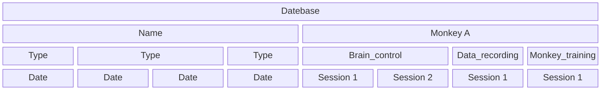
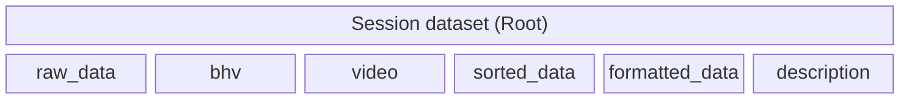
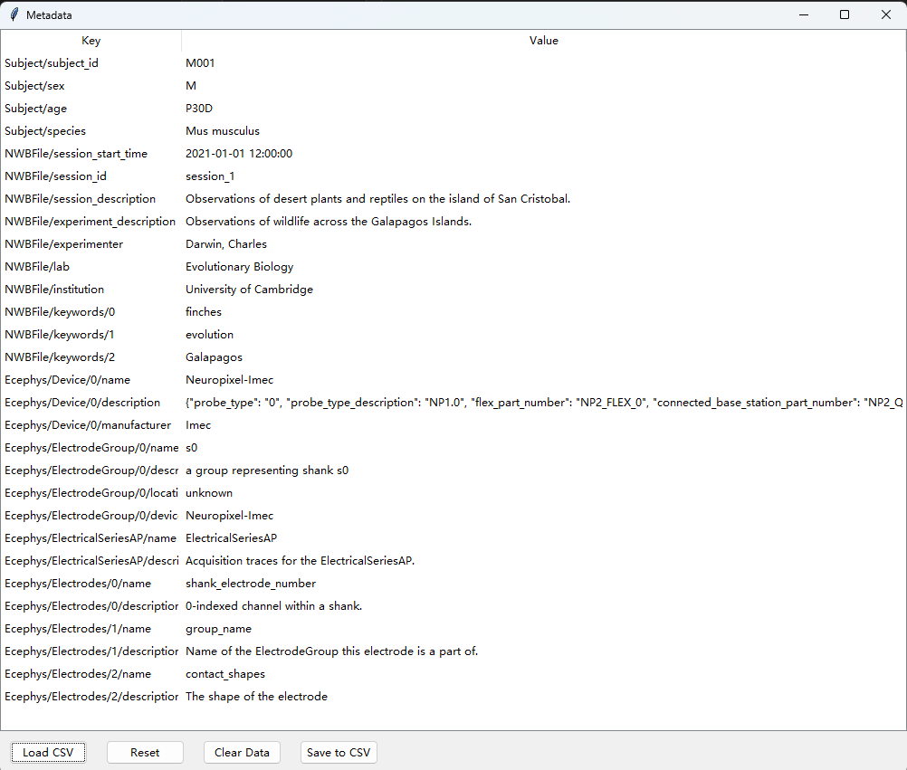
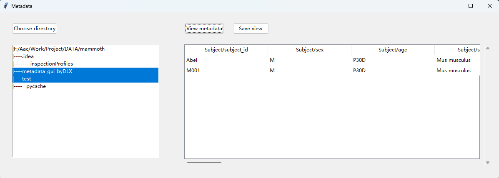
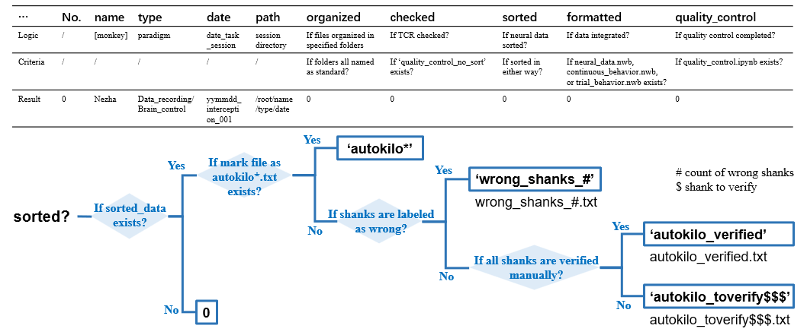

# MAMMOTH Instructions

## Terms
- TCR = threshold crossing rate
- RecordingSystemEvent

## Dataset structure



``` 
[raw_data]: original recording files and converted files
[bhv]: continuous-behavior recording files
[video]: video recording files
[sorted_data]: sorted neural data collected in subfolders named by sorting algorithms
[formatted_data]: formatted NWB files
[description]: checking results and metadata files
```

## Data organizer

This `data_organizer.py` aims to distribute files with certain suffix names into target folders with specified names. For example, the files in the forms of .ns6, .ns3, .ns2, .ccf, .nev, and .rec, would be moved to 'raw_data' folder.


> *function* **handle_file(target_folder_name, suffix_name_list, file, file_walk, root_dir)**
> - target_folder_name (str) - the name of the target folder
> - suffix_name_list (list) - the list of the suffix names which should be included in the target folder
> - file_walk (tuple) - as (current directory, sub directory, files) from os.walk
> - root_dir (str) - the parent directory of the target folder
>
> Returns: None

This function would move the files with certain suffix into the target folder.


> *function* **organize_file(root_dir)**
> - root_dir (str) - the root directory for a session
>
> Returns: None

This function would organize the files according this rule: files in forms of .ns6, .ns3, .ns2, .ccf, .nev, and .rec in 'raw_data' folder; files in forms of .mkv, .mp4, and .webm in 'video' folder; files in forms of .png, .mat, .log, .bhv2, and .psydat in 'bhv' folder.


This .py file can also be run in a batch script as

```python data_organizer.py -r /the/root/dir```

---
## Data converter

This `data_converter.py` aims to convert raw recording files into files more suitable for after processing.

Note: The processing depends on `trodes` and `trodesexport`, which should be installed in advance.

> *function* **convert_file(data_dir)**
> - data_dir (str) - the directory including recording files (usually the 'raw_data' folder, see [Data organizer](#data-organizer))
>
> Returns: None

This function would search for recording files in the 'data_dir' folder automatically and convert the raw files into extended files in different sub folders.

This .py file can also be run in a batch script as

```python data_converter.py -d /the/path/your/data/located/in```

---

## Data formatter 
### Format continuous-behavior data

This `data_formatter_bhv_continuous.py` aims to format continuous-behavior data into an NWB file. When used, it requires `template_bhv_data.yml` and `user_input_entry_collection.py`. 

Note: The `SmartNeo` module should be installed in advance.

> *function* **find_files_with_name(root_dir, pattern)**
> - root_dir (str) - the root directory for a session
> - pattern (str) - the pattern for searching files, for example, '*behavior.log'
>
> Returns: matches (list) - a list of filenames fitting the pattern 

This function can find files with name fitting given pattern in given root directory.

> *function* **format_file(root_dir, output_dir)**
> - root_dir (str) - the root directory for a session
> - output_dir (str) - the target directory to save output results
>
> Returns: None

This function would first load structure template, then search for '*behavior.log' files in the 'root_dir/bhv' (see [Data organizer](#data-organizer)), and finally output as `continuous_behavior.nwb` in the 'output_dir' folder by gathering 'frame info', 'pos', 'state', 'coefficient', 'Event marker', and 'Trial info' data via ```SmartNeo```. The data structure see ```template_bhv_data.yml```.

This .py file can also be run in a batch script as

```python data_formatter_bhv_continuous.py -r /the/root/dir -o /the/output/dir```

---

### Format trial data (MokeyLogic)
This `data_formatter_trial_ML.py` aims to format trial data into an NWB file. When used, it requires `template_trial_data.yml` and `user_input_entry_collection.py`.

Note: The `SmartNeo` module should be installed in advance.

> *function* **format_file(root_dir, output_dir)**
> - root_dir (str) - the root directory for a session
> - output_dir (str) - the target directory to save output results
>
> Returns: None

This function would load .bhv2 and .mat files from the 'root_dir/bhv' (see [Data organizer](#data-organizer)), and then output as `trial_data.nwb` in the 'output_dir' folder via ```SmartNeo```. The data structure see ```template_trial_data.yml```.

This .py file can also be run in a batch script as

```python data_formatter_trial_ML.py -r /the/root/dir -o /the/output/dir```

---

### Format unsorted neural data (BlackRock)

This `data_formatter_TCR_blackrock.py` aims to format unsorted neural data into an NWB file. When used, it requires `template_neural_data.yml`, `user_input_entry_collection.py`, and a fit [Get Probe](#get-probe) function.

Note: The ```SmartNeo``` module should be installed in advance.

> *function* **format_file(root_dir, map_path, output_dir)**
> - root_dir (str) - the root directory for a session
> - map_path (str) - the path of probe map
> - output_dir (str) - the target directory to save output results
>
> Returns: None

This function would first load probe, then search and load the .ns6 file from the 'root_dir' folder for time stamps, collect TCR and RecordingSystemEvent, and finally output as `neural_data_no_sort.nwb` in the 'output_dir' folder via ```SmartNeo```. The data structure see ```template_neural_data.yml```.

This .py file can also be run in a batch script as

```python data_formatter_TCR_blackrock.py -r /the/root/dir -o /the/output/dir -mp /the/map/path``` 

---

### Format sorted neural data (BlackRock)

This `data_formatter_neural_blackrock.py` aims to format sorted neural data (see [Data sorter](#data-sorter)) into an NWB file. When used, it requires `template_neural_data.yml`, `user_input_entry_collection.py`, and a fit [Get Probe](#get-probe) function.

Note: The ```SmartNeo``` module should be installed in advance.

> *function* **format_file(root_dir, map_path, output_dir)**
> - root_dir (str) - the root directory for a session
> - map_path (str) - the path of probe map
> - output_dir (str) - the target directory to save output results
>
> Returns: None

This function would first load probe, then search and load the .ns6 file from the 'root_dir' folder for time stamps, collect spike (from 'root_dir/sorted_data' see [Dataset structure](#dataset-structure)), TCR, LFP, and RecordingSystemEvent, and finally output as `neural_data.nwb` in the 'output_dir' folder via ```SmartNeo```. The data structure see ```template_neural_data.yml```.

This .py file can also be run in a batch script as

```python data_formatter_neural_blackrock.py -r /the/root/dir -o /the/output/dir -mp /the/map/path``` 


---

## Data sorter
### Sort neural data recorded with Utah arrays (BlackRock)

This `data_sorter_utah_96_blackrock.py` aims to sort neural data recorded with a 96-channel Utah Array. 

==To be filled==
---

### Sort neural data recorded with flexible arrays (SpikeGadgets)

This `data_sorter_fa_1024_spikegadgets.py` aims to sort neural data recorded with a 1024-channel flexible probe. 

> *function* **sorting(root_dir, map_path, output_dir, container_dir)**
> - root_dir (str) - the root directory for a session
> - map_path (str) - the path of probe map
> - output_dir (str) - the target directory to save output results
> - container_dir (str) - the directory container file located in
>
> Returns: None

This function would first load probe and set device, then perform sorting with ```spikeinterface``` module, based on the '.rec' file searched from the 'root_dir' folder. In the container directory, there should be a singularity image file which fits the sorting method. The sorting results would be saved in 'root_dir/sorted_data' (see [Dataset structure](#dataset-structure))

This .py file can also be run in a batch script as

```python data_sorter_fa_1024_spikegadgets.py -r /the/root/directory/path -mp /the/map/path -o /the/output/directory/path -cp /the/directory/path/container/located/in``` 

---

### Summarize sorting results

This `data_sorter_voting.py` aims to compare the sorting results with different sorting algorithms and provide summarized suggestion.

Note: Here, the sorting results with **Kilosort 2.5** and **SpykingCircus** are compared.

> *function* **compare(ks_dir, skc_dir)**
> - ks_dir (str) - the output-folder path of Kilosort 2.5
> - skc_dir (str) - the output-folder path of SpykingCircus
>
> Returns: None

This function would load and compare the sorting results via `spikeinterface`, it will rename the original `cluster_KSLabel.tsv` resulted from Kilosort 2.5 as `cluster_KSLabel.tsv.origin`, and build a new `cluster_KSLabel.tsv` where clusters agreed by both algorithms would be marked as 'best' in 'KSLabel'.

This .py file can also be run in a batch script as

```python data_sorter_voting.py -r /the/root/directory/path``` 

---
## Data checker
### Slice continuous-behavior data into trials 

This `data_checker_bhv_slicing.py` aims to slice the continuous-behavior data (in the forms of the NWB file, see [Data formatter](#format-continuous-behavior-data)) into trials. 

Note: The ```SmartNeo``` module should be installed in advance.

> *function* **run(data_dir, output_dir)**
> - data_dir (str) - the folder directory where NWB data was saved 
> - output_dir (str) - the target directory to save output results
>
> Returns: None

This function would load and read NWB file (`continuous_behavior.nwb`) from the 'data_dir'; after processing the data with `pandas.DataFrame`, it would generate `frame_df.csv`. `coeff_df.csv`, `pos_df.csv`, and `trial_df.csv` in the 'output_dir' folder.

This .py file can also be run in a batch script as

```python data_checker_bhv_slicing.py -d /the/path/your/nwb/data/located/in -o /the/output/dir``` 

---

### Plot channel maps

This `data_checker_channel_map_plotting.py` aims to plot the probe map.

> *function* **run(map_path, output_dir)**
> - data_dir (str) - the folder directory where NWB data was saved 
> - map_path (str) - the path of probe map
> - output_dir (str) - the target directory to save output results
>
> Returns: None

This function would first load probe with [Get probe](#get-probe), then save the map figure as `channel_map.png` in the 'output_dir' folder.

This .py file can also be run in a batch script as

```python data_checker_channel_map_plotting.py -o /the/output/dir/ -mp /the/map/path``` 

---

### Validate channel consistency

This `data_checker_channel_consistency.py` aims to check if the channel data from TCR data and sorted spike data are consistent.

Note: There should be sorted spike data. The ```SmartNeo``` module should be installed in advance.

> *function* **run(data_dir, output_dir, root_dir)**
> - data_dir (str) - the folder directory where NWB data was saved 
> - output_dir (str) - the target directory to save output results
> - root_dir (str) - the root directory for a session
>
> Returns: None

This function would first load and read TCR and spike data from `neural_data.nwb` in 'data_dir' (see [Data formatter](#format-sorted-neural-data-blackrock)), then compare their time of spike trains in both unshuffled and shuffled situations. The comparison results would be saved as `chn_consis_summary.png` in the 'output_dir' folder. Moreover, it would search and load .ns6 file from the 'root_dir' folder, and generate a series of `chn_##.png` files in a new subfolder named as 'chn_waveform' in the 'output_dir' folder.

This .py file can also be run in a batch script as

```python data_checker_channel_consistency.py -d /the/path/your/nwb/data/located/in -o /the/output/dir/ -r /the/root/dir/ ``` 

---

### Validate time consistency

This `data_checker_time_consistency.py` aims to check if the event markers from neural data and behavioral data are consistent.

Note: Both of the neural data and behavioral data should in the forms of NWB files. The ```SmartNeo``` module should be installed in advance.

> *function* **run(data_dir, output_dir)**
> - data_dir (str) - the folder directory where NWB data was saved 
> - output_dir (str) - the target directory to save output results
>
> Returns: None

This function would first load and read neural data and behavioral data from `neural_data_no_sort.nwb` and `continuous_behavior.nwb` in 'data_dir' folder (see [Data formatter](#data-formatter)), then compute the time difference between two markers of the same event but from different sources. The results would be saved as `Time_consistency_check.png` and `diff_time_mean.txt` in the 'output_dir' folder.

This .py file can also be run in a batch script as

```python data_checker_time_consistency.py -d /the/path/your/nwb/data/located/in -o /the/output/dir/``` 

---

### Compute neural correlation

This `data_checker_neural_correlation.py` aims to validate the correlation between recorded neural activity and hand position.

Note: The ```SmartNeo``` module should be installed in advance.

> *function* **run(data_dir, output_dir, description_dir)**
> - data_dir (str) - the folder directory where NWB data was saved 
> - output_dir (str) - the target directory to save output results
> - description_dir (str) - the folder directory where descriptive data located in
>
> Returns: None

This function would first load and read neural data and behavioral data from `neural_data.nwb` and `continuous_behavior.nwb` in 'data_dir' folder (see [Data formatter](#data-formatter)), as well as `diff_time_mean.txt`, `pos_pd.csv`, and `coeff_pd.csv` in 'description_dir' (see above). Then, it computes the correlation between neural activity (TCR) and hand position using Lasso. The results would be saved as `correlation_test_score.txt` in the 'output_dir' folder.

This .py file can also be run in a batch script as

```python data_checker_neural_correlation.py -d /the/path/your/nwb/data/located/in -o /the/output/dir/ -s /the/path/your/descriptive/data/located/in``` 

---
## Metadata management
### Generate and edit metadata

This `metadata_generator.py` aims to provide an interactive interface to edit metadata. When used, it requires `metadata_template.csv`. 

Run `metadata_generator.py` and there would appear a GUI for metadata edition.



The interface is initially blank, after loading a ```template.csv``` with the ```Load CSV``` button, the Key and Value would show. Each cell can be editted. With ```Reset``` button clicked, the interface would be reset to the loaded version. The content on the interface can be erased with the ```Clear Data``` button. The metadata shown on this interface can be saved with the ```Save to CSV``` button, with given filename and path.

---

### View metadata

This `metadata_viewer.py` aims to provide an interactive interface to view multiple metadata entries at the same time.

Run `metadata_viewer.py` and there would appear a GUI for metadata overview.



After clicking the `Choose directory` button, a asking window would appear for directory selection and then the listbox below would show the tree structure of the selected directory. More than one items in the listbox can be selected at the same time. By clicking ```View metadata``` button, a table would appear showing all metadata contents in the selected directory. This view can be saved by clicking ```Save view``` button.

---
## Helpers
### Get probe

This helper, aiming to get certain probe information, can be extended to a series of scripts, with `get_probe_bohr_utah96.py` as an example. 

Note: The probes used in different subjects are different, so that defining special get_probe_*.py would be more useful. 

> *function* **get(map_path)**
> - map_path (str) - the path of probe map
>
> Returns: probegroup (probeinterface.ProbeGroup)

This function would load probe information and return a probegroup as an instance of the class 'probeinterface.ProbeGroup'

---

### Scan dataset

This `scan_dataset.py` aims to help overview the processing progress of all datasets in the database. 

> *function* **get_all_sessions(root_path, meta_path)**
> - root_path (str) - the path of the database
> - meta_path (str) - the path to save metadata, i.e. the output 
>
> Returns: None

This function would walk through the database and get a list of all datasets with 'name', 'type', 'date', and 'path' features (see [Dataset structure](#dataset-structure)), which would be saved as `yyyymmdd_all_sessions_list.csv` in the 'meta_path' folder.

> *function* **get_newest_file(path, name)**
> - path (str) - the path of the folder to be searched
> - name (str) - the key words should be included in the filename 
>
> Returns: the path of the fit file

This function searched for the newest .csv file with the given key words in the filename.

> *function* **get_and_scan_fit_sessions(meta_path)**
> - meta_path (str) - the path to save metadata, i.e. the output 
>
> Returns: None

This function would read the newest `yyyymmdd_all_sessions_list.csv` in the 'meta_path' folder to generate a table to show the processing progress of each dataset and save as `yyyymmdd_scan_fit_sessions.csv` also in the 'meta_path' folder. The table is as below



This .py file can also be run in a batch script as

```python scan_dataset.py -r /the/root/dir/ -o /the/output/dir/``` 

---

### marktxt

This is a tag file to mark the progress of sorting.

- Generated during automatic sorting (see [Data sorter](#sort-neural-data-recorded-with-flexible-arrays-spikegadgets)), originally named as auto*.txt, here * means the short name of the sorting method, for example, autokilo.txt for Kilosort 2.5.
- After sorting summary (see [Data sorter](#summarize-sorting-results)), the file would be renamed as auto*_voted.txt
- After dataset scanning (see above),
  - If there are errors during sorting, wrong_shanks_#.txt, with # represents the number of wrong shanks.
  - If there are no errors during sorting, 
     - auto*[_voted]_verified.txt, already manual verified
     - auto*[_voted]_toverify\$\$\$.txt, with shank data of ids \$ to be mannually verified.

---